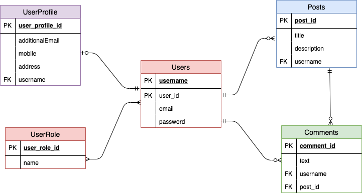
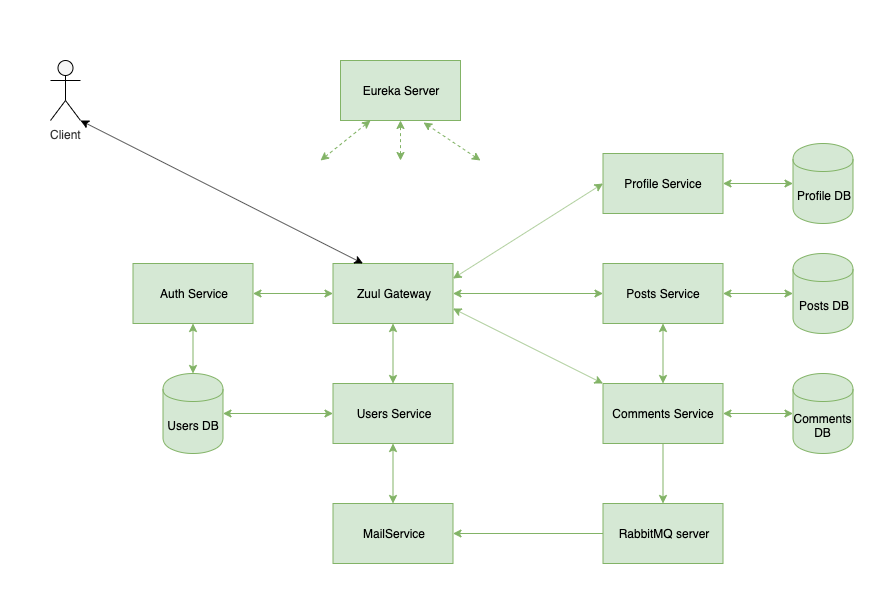

# Project 3
By Davis Allen and Ariel Mendoza

## Technologies Used
* Spring Boot
* Maven
* Pivotal Cloud Foundry
* Docker
* Feign Client
* Flyway
* Eureka Server
* Pivotal Tracker
* Postgresql
* IntelliJ

## Approach
After setting up the initial stories for essential functionality, we decided to begin by setting up a skeleton of the application including a eureka server and api gateway, and microservices for auth and posts, to tackle getting a microservice application up and running on pivotal cloud foundry. Once that was running successfully, we focused on building out the core services.

Before Zuul routes any request on to the microservices, it first calls a dedicated Auth Service (this is implemented with Zuul's Pre Filters).

We tried to keep everything as loosely coupled as possible. We have separate databases for each service. Posts and Comments services are the only two services which talk to each other (excluding zuul and eureka).

We used username as the foreign key wherever possible, allowing us to avoid needing to call the user database for user info.

 

## Challenges
Our first major challenge was figuring out how to properly configure the services for deployment on PCF. Aside from that, our other major hurdle was retrieving data from multiple services based on one request, such as retrieving all of a user’s posts.

We also had issues with serializing objects out to JSON and deserializing objects we were getting back in JSON.

## Diagrams
### ERD

### Architecture

## User Stories
[Pivotal Tracker](https://www.pivotaltracker.com/n/projects/2417875)

## Links of Interest

[eureka server](http://dba-docker-test-eureka.cfapps.io/)

[post microservice](http://dba-docker-test-api-gateway.cfapps.io/post/)

[auth microservice](http://dba-docker-test-api-gateway.cfapps.io/auth/)

[post microservice communicating with auth microservice](http://dba-docker-test-api-gateway.cfapps.io/post/myposts)
